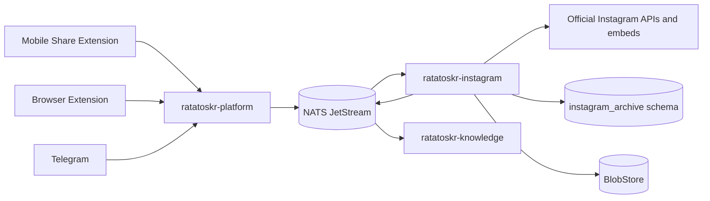
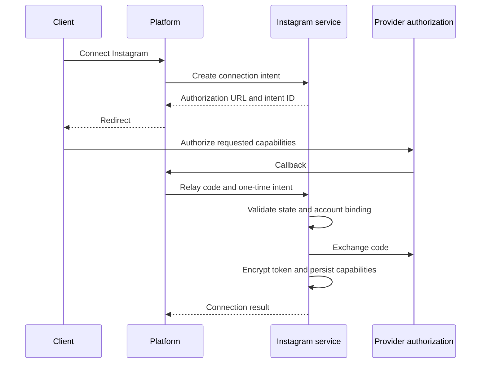
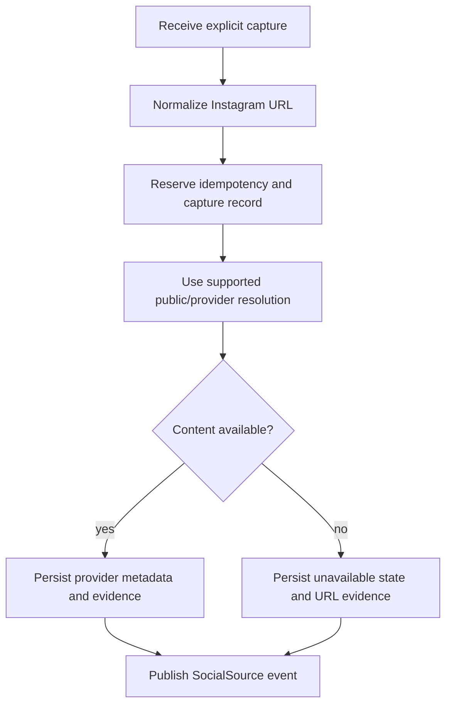

# Ratatoskr Instagram Architecture

> Status: target architecture. This repository is in architecture bootstrap. Provider capabilities are treated as versioned runtime facts and must be verified against the official API during implementation.

## 1. Purpose

`ratatoskr-instagram` archives Instagram-related content through supported, consented acquisition paths while preserving honest provenance.

The service has two distinct lanes:

1. **Official account lane** — user-authorized access to capabilities available to the connected account type.
2. **Explicit capture lane** — user-initiated saves from mobile Share Extensions, browser extension, Telegram, or imports.

The service also supports safe, versioned imports of official user Data Export archives.

It does not claim that a Ratatoskr capture is a mirror of Instagram's native Saved list. It does not store user passwords, browser cookies, or use hidden website APIs or stealth browser automation.

## 2. Architectural position



Platform authenticates Ratatoskr users and accepts capture commands. Instagram owns provider-specific resolution, account connection, import parsing, and provider provenance.

## 3. Repository structure

```text
ratatoskr-instagram/
├── crates/
│   ├── instagram-domain/
│   ├── accounts/
│   ├── oauth/
│   ├── captures/
│   ├── public-resolution/
│   ├── media/
│   ├── data-export/
│   ├── provider-client/
│   ├── persistence/
│   ├── eventing/
│   ├── telemetry/
│   └── test-support/
├── services/
│   └── instagram/
├── schema/
├── fixtures/
│   ├── captures/
│   └── data-exports/
├── tests/
└── docs/
```

Official account access, public resolution, and Data Export parsing are separate adapters because their permissions, data shapes, and authority differ.

## 4. Bounded context and data ownership

Recommended schema:

```text
instagram_archive.accounts
instagram_archive.credentials
instagram_archive.account_capabilities
instagram_archive.media_objects
instagram_archive.media_revisions
instagram_archive.captures
instagram_archive.capture_attempts
instagram_archive.public_resolutions
instagram_archive.export_snapshots
instagram_archive.import_runs
instagram_archive.import_run_transitions
instagram_archive.export_records
instagram_archive.export_completeness_reports
instagram_archive.unavailable_sources
instagram_archive.outbox
instagram_archive.inbox
```

The service owns Instagram-specific provider records and acquisition evidence. It does not own global user identity, local collections, article documents, summaries, embeddings, or client queues.

## 5. Provenance model

Every stored item records how it entered Ratatoskr and what that proves.

```text
acquisition:
  OfficialApi
  ShareExtension
  BrowserExtension
  TelegramCapture
  DataExport
  LegacyImport

saved_authority:
  ExplicitUserCapture
  ExportObservation
  ProviderAccountObservation
  LegacyObservation
```

`AuthoritativePlatformState` is not used for native Instagram Saved membership unless an official supported API explicitly provides that state in the future.

### 5.1. Capture evidence

A capture proves:

- a Ratatoskr user explicitly requested preservation;
- the URL, timestamp, client, note, and requested collection/tag metadata;
- the result of provider resolution at that time.

It does not prove:

- that the item was or remains in native Instagram Saved;
- that the item remains public;
- that the user owns or is authorized to redistribute the media;
- that a later missing item was intentionally deleted by the author.

## 6. Official account lane

### 6.1. Capability-driven connection

The service records capabilities actually granted to the connected account and application configuration.

Possible capability families:

```text
account identity
own media listing
own media metadata
comments or interactions
publishing
insights
messaging
```

No downstream component assumes a capability exists merely because an account is connected.

### 6.2. OAuth architecture

Platform may expose the public callback, but Instagram owns:

- authorization intent;
- state/nonce and user binding;
- provider code exchange;
- token encryption and refresh;
- granted-scope and capability records;
- revocation and reauthorization state.



### 6.3. Account observations

Account and own-media synchronization uses provider timestamps and stable external IDs when available. Partial scans do not prove deletion. Missing objects transition only under a documented authoritative full-listing or explicit provider deletion signal.

### 6.4. Own-media synchronization

The local scheduler is disabled by default and selects a finite number of due accounts per delayed
tick. It evaluates the current total `own_media_read` generation before opening credentials. Each
accepted page stores raw content-addressed JSON, staged metadata, and the opaque continuation in one
transaction. Retryable runs resume the single active generation.

The durable watermark is the newest stable provider media ID from the last completed traversal, not
a provider cursor. Incremental completion must reach that prior ID; initial completion must reach
the collection end. A final transaction revalidates owner, account identity, connection, and
capability generation, applies normalized revisions and SocialSource outbox facts, swaps the account
authority pointer, and advances the watermark. Until then observers see only the previous complete
generation. Prefix absence proves no deletion. Stories, foreign owners, and media-byte downloads are
outside this lane.

## 7. Explicit capture lane

### 7.1. Capture command

A normalized command includes:

```text
owner_user_id
canonical_url_candidate
captured_at
capture_source
client_id
idempotency_key
optional note
optional local collection/tag intents
optional user-supplied attachment references
```

The service validates that the URL belongs to supported Instagram URL families before resolution.

### 7.2. Capture flow



The webhook/API request is not held open for long resolution. Platform operation events communicate progress.

### 7.3. Canonical URL handling

The service preserves:

- original captured URL;
- normalized URL;
- provider canonical URL when verified;
- redirects or short-link observations;
- external content ID when resolvable.

A page-provided canonical URL is validated before trust.

## 8. Public resolution and embeds

Public resolution may use officially supported embed/oEmbed or API surfaces.

A resolution result can include:

- provider object ID;
- canonical URL;
- author/account display metadata;
- caption or public text;
- media type and dimensions;
- thumbnail/embed representation;
- publication timestamp when available;
- provider response/blob reference;
- resolution timestamp and capability version.

Public resolution is not a general-purpose scraper. If the official resolver no longer supports a URL, the service records `content_unavailable` without attempting hidden browser-session access.

## 9. Private and unavailable content

State examples:

```text
available_public
available_authorized_account
private
login_required
removed
expired
unsupported
access_lost
unknown
```

Rules:

- do not bypass privacy or login barriers;
- preserve capture URL, user note, timestamps, and failure classification;
- do not expose cached private content to users who lack ownership;
- treat access loss separately from deletion;
- user-supplied screenshots/files are separate artifacts with `UserProvided` provenance;
- revalidation can update availability without erasing prior capture evidence.

## 10. Media architecture

Provider metadata and media bytes have separate policies.

Metadata may include:

```text
media type
provider media ID
caption
alt/accessibility text
width and height
duration
thumbnail observation
carousel children
publication time
```

Media download/storage occurs only when:

- officially supported or explicitly user-supplied;
- policy permits local preservation;
- size and MIME limits pass;
- ownership/access is validated;
- BlobStore retention is configured.

Remote URLs are observations and may expire. They are never treated as durable backups.

## 11. Data Export architecture

### 11.1. Raw-first import

Official user exports are stored immutably before parsing.

```text
receive archive
-> streaming hash
-> immutable raw BlobStore object
-> safe archive inspection
-> provider/schema detection
-> bounded metadata inspection and entry reads (no path materialization)
-> versioned parser
-> staging validation
-> reconcile provider records
-> completeness report
-> publish import events
```

### 11.2. Safe archive handling

- reject path traversal and absolute paths;
- cap file count and decompressed size;
- detect archive bombs;
- MIME sniff rather than trust extension;
- do not execute or render active HTML;
- preserve unknown files and JSON sections as raw evidence;
- derive storage keys from hashes, not archive paths.

### 11.3. Versioned parsers

Parsers are selected by detected export structure and version. Unknown record variants are retained and reported; they are not silently ignored.

The first registry entry is `instagram-saved-posts-json-v1` and recognizes exactly
`your_instagram_activity/saved/saved_posts.json`. Changing that grammar adds another parser id; it
does not reinterpret an existing run. Current compatibility evidence is synthetic/redacted only.

### 11.4. Completeness

An import report distinguishes:

```text
parsed known categories
unknown categories
referenced media present/missing
relationships resolved/unresolved
saved-like export observations found/not found
schema confidence
warnings
```

Absence of a category in one export is not proof that provider data was deleted.

Runs advance with compare-and-swap transitions `received -> inspected -> parsed -> reconciled`;
`failed` is terminal. Reconciliation commits normalized revisions, owner-scoped SocialSource facts,
the sorted set report, and the terminal transition atomically. The report compares distinct stable
export identities to owner captures as `matched`, `export_only`, `capture_only`, and
`non_comparable`; counts are the exact list cardinalities. No gap mutates a capture, tombstone, or
availability observation.

## 12. Normalized social source

The service publishes a shared `SocialSource` with Instagram-specific provenance.

```text
platform = Instagram
external_id = provider object ID when known
canonical_url
acquisition
saved_authority
author
published_at
captured_at
text/caption
media descriptors
relations
raw_blob_ref
content_hash
upstream_status
```

Local collections are referenced by Platform-owned commands/projections and are not represented as native Instagram collections.

## 13. Duplicate and revision semantics

Potential duplicate keys:

1. stable provider object ID;
2. verified canonical URL;
3. content hash plus author/time evidence;
4. capture idempotency key.

Two captures by the same user may share one provider object but retain separate capture intent, note, and timestamp.

Changed captions or metadata create provider observations/revisions rather than destructive overwrite.

## 14. Commands and events

### 14.1. Commands consumed

```text
instagram.account.connect_requested.v1
instagram.account.sync_requested.v1
instagram.capture.requested.v1
instagram.source.revalidate_requested.v1
instagram.data_export.import_requested.v1
```

### 14.2. Events emitted

```text
instagram.account.connected.v1
instagram.account.reauth_required.v1
instagram.media.observed.v1
instagram.capture.resolved.v1
instagram.capture.unavailable.v1
instagram.data_export.ingested.v1
instagram.data_export.partial.v1
social.source.captured.v1
social.source.updated.v1
social.source.removed.v1
knowledge.analysis.completed.v1
```

Events contain references and bounded metadata, not tokens or large media payloads.

## 15. Persistence and transactions

Transactions group:

- capture reservation/idempotency;
- provider-record observations;
- import staging/reconciliation state;
- current projections;
- outbox insertion.

Provider calls and BlobStore uploads occur outside database transactions. Durable intermediate states make retries safe.

Inbox deduplication handles at-least-once command delivery.

## 16. Failure model

### Transient

- provider resolver/API timeout;
- rate limiting;
- token refresh issue;
- BlobStore, database, or event-bus outage.

### Action-required

- token revoked or capability removed;
- account type unsupported for requested operation;
- content private/login-required;
- user needs to reauthorize.

### Permanent for a specific capture

- unsupported URL family;
- malformed URL;
- content removed or unresolvable through supported surfaces;
- user-provided file violates limits.

Unavailable content is a valid archived outcome with provenance, not necessarily a system failure.

## 17. Security boundaries

- No server-side provider password, cookie, session, or hidden API storage.
- No stealth browser automation or anti-bot bypass.
- Tokens are encrypted and scoped to the Instagram service.
- OAuth state and callback binding are one-time and expiry-checked.
- Capture URLs and archives are hostile input.
- Private content is never exposed across users.
- Active HTML is not rendered during archive import.
- Media MIME, size, and hash are verified.
- Events/logs exclude tokens, private captions/media, raw exports, and signed URLs.
- Source content cannot authorize provider writes.
- User-provided artifacts are labelled separately from provider-derived content.

## 18. Rate limits and capability change

The service tracks endpoint-specific limits, reset windows, provider response IDs, and capability versions.

Background account sync yields to explicit captures and user-triggered operations. A provider capability disappearing transitions affected features to unsupported/reauth-required without corrupting existing archives.

Capability assumptions are not hard-coded into shared contracts; they are represented as account/service capabilities.

## 19. Observability

Required telemetry:

```text
instagram_api_requests_total
instagram_resolution_duration_seconds
instagram_resolution_results_total
instagram_capture_requests_total
instagram_capture_unavailable_total
instagram_account_sync_duration_seconds
instagram_reauth_required_total
instagram_data_export_stage_total
instagram_data_export_stage_duration_seconds
instagram_data_export_failure_total
instagram_data_export_category_records_total
instagram_data_export_warnings_total
instagram_data_export_completeness_gap_count
instagram_media_bytes_stored
queue_lag_seconds
```

Metrics avoid raw URLs, handles, captions, or media identifiers as unbounded labels.

## 20. Testing architecture

### Unit

- URL recognition and normalization;
- provenance and authority classification;
- capture idempotency;
- provider record deduplication/revision;
- account capability decisions;
- availability transitions;
- Data Export schema detection.

### Integration

- OAuth intent and encrypted credential lifecycle;
- fake public resolver/provider API;
- SQL schema initialization and transactions;
- BlobStore raw exports/media;
- outbox/inbox replay;
- interrupted import resume.

### Adversarial

- malformed and deceptive URLs;
- archive path traversal and bombs;
- oversized media;
- HTML/script payloads;
- provider responses with unknown variants;
- private-content access changes.

### Planned workspace end-to-end

- mobile/browser explicit capture;
- public resolution and SocialSource indexing;
- unavailable capture displayed truthfully;
- official account sync under capability checks;
- Data Export import and completeness report;
- search in Knowledge without exposing provider credentials.

## 21. Deployment architecture

Runtime roles may include:

```text
OAuth/internal command handlers
explicit capture resolver
account sync consumer
Data Export import worker
revalidation worker
```

Roles use bounded concurrency and may share one image.

Dependencies:

- PostgreSQL `instagram_archive` role;
- NATS JetStream;
- secret encryption backend;
- official provider API/embed access;
- BlobStore.

No browser profile, Chromium dependency, Git CLI, or direct Knowledge database access is required.

## 22. Migration architecture

Legacy Instagram-like captures are imported with explicit `LegacyImport` and `LegacyObservation` provenance.

Migration process:

1. Preserve original URL, timestamps, notes, files, and raw metadata.
2. Normalize supported URL forms.
3. Resolve only through supported current provider surfaces.
4. Keep unresolved items as archived captures.
5. Deduplicate provider objects while preserving separate capture intents.
6. Build SocialSource projections.
7. Reindex through Knowledge.
8. Never reinterpret legacy captures as native Saved state.

## 23. Architectural invariants

1. Official account access and explicit capture are separate lanes.
2. A Ratatoskr capture is not authoritative native Saved state.
3. Acquisition method and saved authority are mandatory.
4. Provider credentials remain inside this service.
5. No password, cookie, hidden API, or stealth browser synchronization is used.
6. Public resolution uses supported provider surfaces only.
7. Private or unavailable content is recorded truthfully, not bypassed.
8. User-supplied artifacts are distinct from provider-derived media.
9. Raw Data Export archives are stored before parsing.
10. Unknown export records are preserved.
11. Missing export categories do not prove deletion.
12. Analysis is delegated to Knowledge.
13. Delivery is at-least-once and handlers are idempotent.
14. Provider capability changes are explicit runtime state.

## 24. Evolution

Initial milestones:

1. URL/provenance model and explicit capture command.
2. Public resolution adapter and unavailable-state handling.
3. SocialSource event and Knowledge integration.
4. Account connection with capability recording.
5. Own-media observation where supported.
6. Raw-first Data Export intake and first versioned parser.
7. Completeness reports and unknown-record preservation.
8. User-supplied media path and privacy controls.
9. Revalidation, rate-limit budgets, and operational runbooks.
10. Migration of legacy captures.

Changes to acquisition authority, provider-session policy, or private-content handling require ADRs and coordinated workspace changesets.
